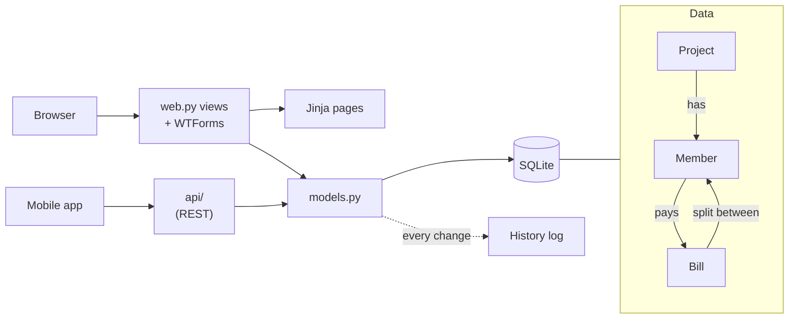

# I Hate Money · OpenSpec

## The app

I Hate Money is a small Flask website for shared budgets: flatmates, a trip, a club. A project
has members, members add the bills they paid and say who they were for, and the app works out who
owes whom. Every page is a Flask view plus a Jinja template, data lives in SQLite through
SQLAlchemy, and the mobile app talks to the same data through a REST API.



## The problem

Rent, internet, a streaming subscription: a shared household pays the same bills every month, and
today someone has to type each one in again. Members want recurring bills: set one up once, and
every occurrence turns up on its date with the right people and amount, never twice. The app is
a single web process with no background jobs, so part of the work is deciding when and how those
bills get created.

It touches most of the app: data model and migrations, the bill form, a new page, the change
history, the API the mobile app uses. It's big on purpose.

## Getting started

Needs [uv](https://docs.astral.sh/uv/) and Node 20+. uv installs Python 3.11+ for you. No database
server, no Docker.

```bash
npm i -g @fission-ai/openspec@1.13.2
uv run --extra dev pytest -q               # the test suite
uv run flask --app workshop run --debug    # look around at http://localhost:5000/demo, then Ctrl+C
git checkout -b my-recurring-bills
```

Open your harness in this folder (`claude`, `opencode` or `codex`) and type:

```text
/opsx:explore Add recurring bills. When adding a bill, a member can make it repeat every week, month or year from the bill's date, optionally until an end date. Every occurrence that has come due is added as a normal bill with the same payer, people, amount and currency, even if nobody opened the project for months. A monthly bill on the 31st falls on the last day of shorter months. An occurrence is never added twice, not even when two members open the project at the same moment, and one that was deleted by hand never comes back. A new page lists the project's recurring bills with their next date. From there a member can edit one (future occurrences only), pause, resume or stop it, and skip the next occurrence. Bills added this way link back to their recurring bill, changes to recurring bills show in the project history, and the API lets the mobile app manage them. Existing bills, exports and the API must keep working.
```

In opencode start with `/opsx-explore`, in Codex with `$openspec-explore`.

Explore is OpenSpec's thinking mode: the agent reads the code and talks through the decisions
this feature needs, and you choose. Its recommendations are defaults, not answers, so disagree
when you'd decide differently. Explore has no fixed end: when you've made the calls you care
about, ask it for a summary. Then, in the same session, type:

```text
/opsx:propose add-recurring-bills
```

In opencode that's `/opsx-propose`, in Codex `$openspec-propose`.

The agent may ask you one question first, usually which slice to build. Answering it is part of
propose. Aim for about an hour on explore, propose and your review, then apply group by group.

Read what the agent writes before you move on. After each step it tells you the next command.
Lost? Type `next`. Want to know why? Type `explain`. You won't finish the whole feature, and that's
fine: the point is to see what each step does. The agent explains each step as you go.

## Steps

| # | Step | What happens | Claude Code | opencode | Codex |
|---|---|---|---|---|---|
| 1 | explore | Your turn to decide: think the feature through with the agent before any change is written. | `/opsx:explore` | `/opsx-explore` | `$openspec-explore` |
| 2 | propose | Agent writes proposal, specs, design and tasks in `openspec/changes/`, using your decisions. You review and edit them. | `/opsx:propose` | `/opsx-propose` | `$openspec-propose` |
| 3 | apply | Agent works through one task group at a time: migration, code, tests. Run it again for the next group. | `/opsx:apply` | `/opsx-apply` | `$openspec-apply-change` |
| 4 | archive | Once all tasks are done: agent validates the change and merges its specs into `openspec/specs/`. Out of time? Leave the change unarchived. | `/opsx:archive` | `/opsx-archive` | `$openspec-archive-change` |

## Finished early?

Run the steps again for one of these:

- Split a bill by exact amounts or percentages, with cents that always add up to the total
- Close a period: settle up, archive its bills and start fresh (there is a half-built `Archive` model)
- Spending categories, each with a monthly budget and a warning when it's exceeded
- A weekly email to each member saying what they owe and to whom

## Licences

The app is I Hate Money (BSD-style licence), see `LICENSE`; OpenSpec is MIT. What was changed for
this workshop, and the full notices, are in `THIRD-PARTY-NOTICES.md`. This workshop is not
affiliated with or endorsed by these projects.
