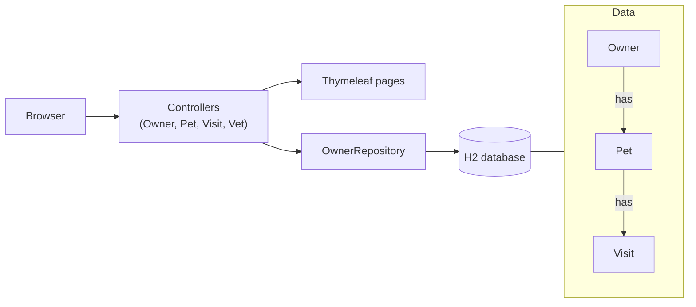

# Spring PetClinic · OpenSpec

## The app

PetClinic is a small website for a vet clinic, built with Spring Boot. Staff look up owners, add
their pets, and book visits. Every page is a Spring controller plus a Thymeleaf template. Data
lives in an in-memory H2 database, reached through the owner: an owner has pets, a pet has visits.



## The problem

Owners call to cancel visits, but the app can only add them. Add cancel: the owner page shows
each visit as scheduled or cancelled, upcoming visits get a Cancel button, and cancelled visits
stay in the history. Visits in the past can't be cancelled.

## Getting started

Needs Java 17+, Node 20+.

```bash
npm i -g @fission-ai/openspec@1.13.2
./mvnw spring-boot:run      # look around at http://localhost:8080, then Ctrl+C
git checkout -b my-cancel-visit
```

Open your harness in this folder (`claude`, `opencode` or `codex`) and type:

```text
/opsx:propose Receptionists need to cancel an upcoming visit when an owner calls. On the owner details page each visit shows whether it is scheduled or cancelled, upcoming visits get a Cancel action, and cancelled visits stay visible in the history, marked as cancelled. Visits in the past can't be cancelled.
```

In opencode start with `/opsx-propose`, in Codex with `$openspec-propose`.

Read what the agent wrote before you move on. After each step it tells you the next command.
Lost? Type `next`.

## Steps

| # | Step | What happens | Claude Code | opencode | Codex |
|---|---|---|---|---|---|
| 1 | propose | Agent writes proposal, specs, design and tasks in `openspec/changes/`. You review and edit. | `/opsx:propose` | `/opsx-propose` | `$openspec-propose` |
| 2 | apply | Agent works through the tasks: code, tests, translations. | `/opsx:apply` | `/opsx-apply` | `$openspec-apply-change` |
| 3 | archive | Run `openspec validate <change> --strict`, then merge the specs into `openspec/specs/`. | `/opsx:archive` | `/opsx-archive` | `$openspec-archive-change` |

## Finished early?

Run the same steps again for one of these:

- Reschedule an upcoming visit (same rules as cancel)
- Upcoming-visits page: next 7 days, all owners, paginated
- Vets on visits: assign a vet, show their schedule, reject double-booking
- Spring Security: receptionist and vet roles (amend the constitution first)
- Flyway migrations for H2, MySQL and Postgres (amend the constitution first)
- JSON API for an owner's visits (amend the constitution first)
