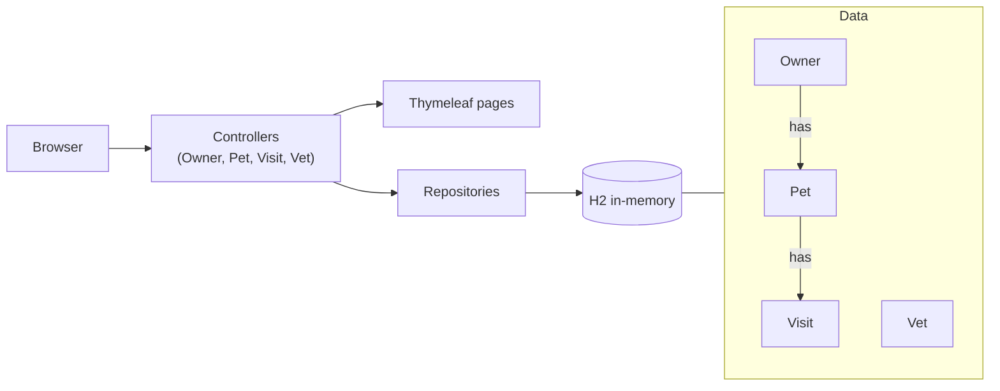

# Spring PetClinic · OpenSpec

## The app

PetClinic is a small website for a vet clinic, built with Spring Boot. Staff look up owners, add
their pets, and record visits. Every page is a Spring controller plus a Thymeleaf template. Data
lives in an in-memory H2 database: an owner has pets, a pet has visits, and the clinic has vets.



## The problem

A visit today is only a date and a note, and vets aren't involved at all. The clinic wants real
appointments: a visit is booked with a specific vet at a specific time, only when the clinic is
open, and a vet can never be in two places at once. Receptionists want to see who is booked when.

## Getting started

Needs Java 17+, Node 20+. No database server, no Docker.

```bash
npm i -g @fission-ai/openspec@1.13.2
./mvnw test                  # ~15 s, no Docker needed
./mvnw spring-boot:run       # look around at http://localhost:8080, then Ctrl+C
git checkout -b my-appointments
```

Open your harness in this folder (`claude`, `opencode` or `codex`) and type:

```text
/opsx:propose Turn visits into appointments. A visit is booked with a specific vet at a start time, lasts 30 minutes, and must fall inside clinic opening hours (Monday to Friday, 08:00 to 16:00). A vet can't be double-booked and appointments can't be in the past. The booking form only offers the chosen vet's free times, the owner page shows each visit's vet and time, and each vet gets a page with their appointments for a day. Existing visits must keep working.
```

In opencode start with `/opsx-propose`, in Codex with `$openspec-propose`.

Read what the agent writes before you move on. After each step it tells you the next command.
Lost? Type `next`. You don't have to finish: the point is to see what each step does.

## Steps

| # | Step | What happens | Claude Code | opencode | Codex |
|---|---|---|---|---|---|
| 1 | propose | Agent writes proposal, specs, design and tasks in `openspec/changes/`. You review and edit them. | `/opsx:propose` | `/opsx-propose` | `$openspec-propose` |
| 2 | apply | Agent works through the tasks: code, tests, translations. | `/opsx:apply` | `/opsx-apply` | `$openspec-apply-change` |
| 3 | archive | Agent validates the change and merges its specs into `openspec/specs/`. | `/opsx:archive` | `/opsx-archive` | `$openspec-archive-change` |

## Finished early?

Run the steps again for one of these:

- Cancel and reschedule appointments (past ones stay locked)
- Merge duplicate owners without losing a pet or a visit
- Invoices: price per visit type, multi-pet discount, VAT, rounding per locale
- Vaccination tracker: due and overdue vaccines per pet, with a clinic-wide overdue list
