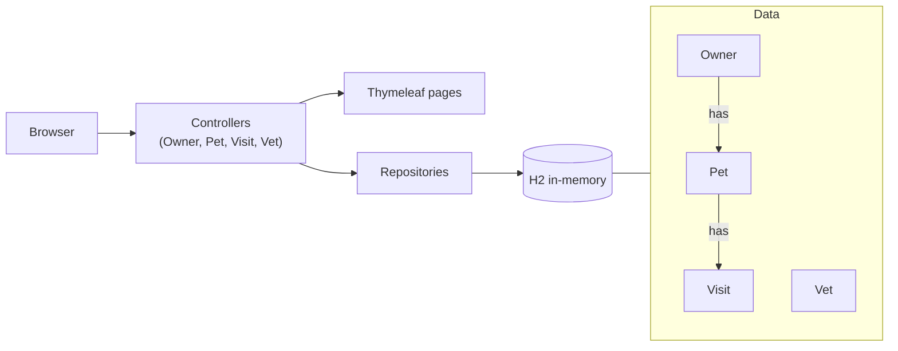

# Spring PetClinic · Spec Kit

## The app

PetClinic is a small website for a vet clinic, built with Spring Boot. Staff look up owners, add
their pets, and record visits. Every page is a Spring controller plus a Thymeleaf template. Data
lives in an in-memory H2 database: an owner has pets, a pet has visits, and the clinic has vets.



## The problem

A visit today is only a date and a note, and vets aren't involved at all. The clinic wants a real
booking system: every vet has a working week, a visit is booked with a vet at a time, a vet is
never in two places at once, surgery needs a surgeon, and receptionists can see and change the
schedule.

It touches most of the app: data model, all three databases, several pages, validation, ten
languages. It's big on purpose.

## Getting started

Needs Java 17+, bash (WSL or Git Bash on Windows). No database server, no Docker.

```bash
./mvnw test                  # ~15 s, no Docker needed
./mvnw spring-boot:run       # look around at http://localhost:8080, then Ctrl+C
git checkout -b my-appointments
```

Open your harness in this folder (`claude`, `opencode` or `codex`) and type:

```text
/speckit-specify Turn visits into appointments with vets. Each vet has a weekly working schedule (default Monday to Friday, 08:00 to 16:00) that the clinic can edit. A visit is booked with a vet at a start time and lasts 30 minutes, or 60 for surgery. A vet can never be double-booked, not even when two receptionists book at the same moment, appointments can't be in the past, and surgery can only be booked with a vet who has the surgery specialty. The booking form only offers the chosen vet's free times, the owner page shows each visit's vet and time, and each vet gets a day and a week schedule page. Receptionists can cancel or move an upcoming appointment. Existing visits must keep working.
```

In opencode start with `/speckit.specify`, in Codex with `$speckit-specify`.

Read what the agent writes before you move on. After each step it tells you the next command.
Lost? Type `next`. Want to know why? Type `explain`. You won't finish the whole feature, and that's
fine: the point is to see what each step does. The agent explains each step as you go.

## Steps

| # | Step | What happens | Claude Code | opencode | Codex |
|---|---|---|---|---|---|
| 1 | specify | Agent writes `specs/<feature>/spec.md`: what and why, no code. It may ask up to 3 big questions first. | `/speckit-specify` | `/speckit.specify` | `$speckit-specify` |
| 2 | clarify | Your turn to decide: the agent asks you up to 5 questions, one at a time, and writes your answers into the spec. | `/speckit-clarify` | `/speckit.clarify` | `$speckit-clarify` |
| 3 | plan | Agent writes `plan.md`: how, which files, checked against the constitution. | `/speckit-plan` | `/speckit.plan` | `$speckit-plan` |
| 4 | tasks | Agent breaks the plan into `tasks.md`, grouped by user story. | `/speckit-tasks` | `/speckit.tasks` | `$speckit-tasks` |
| 5 | analyze | Agent checks spec, plan and tasks against each other. Changes nothing; ask it to fix what it finds. | `/speckit-analyze` | `/speckit.analyze` | `$speckit-analyze` |
| 6 | implement | Agent builds one user story at a time: code, tests, translations. Run it again for the next story. | `/speckit-implement` | `/speckit.implement` | `$speckit-implement` |

## Finished early?

Run the steps again for one of these:

- Waiting list: when a vet is fully booked, offer the next free slot or any free vet
- Merge duplicate owners without losing a pet or a visit
- Invoices: price per visit type, multi-pet discount, VAT, rounding per locale
- Vaccination tracker: due and overdue vaccines per pet, with a clinic-wide overdue list

## Licences

The app is Spring PetClinic (Apache-2.0), see `LICENSE.txt`; Spec Kit is MIT. What was changed for
this workshop, and the full notices, are in `THIRD-PARTY-NOTICES.md`. This workshop is not
affiliated with or endorsed by these projects.
