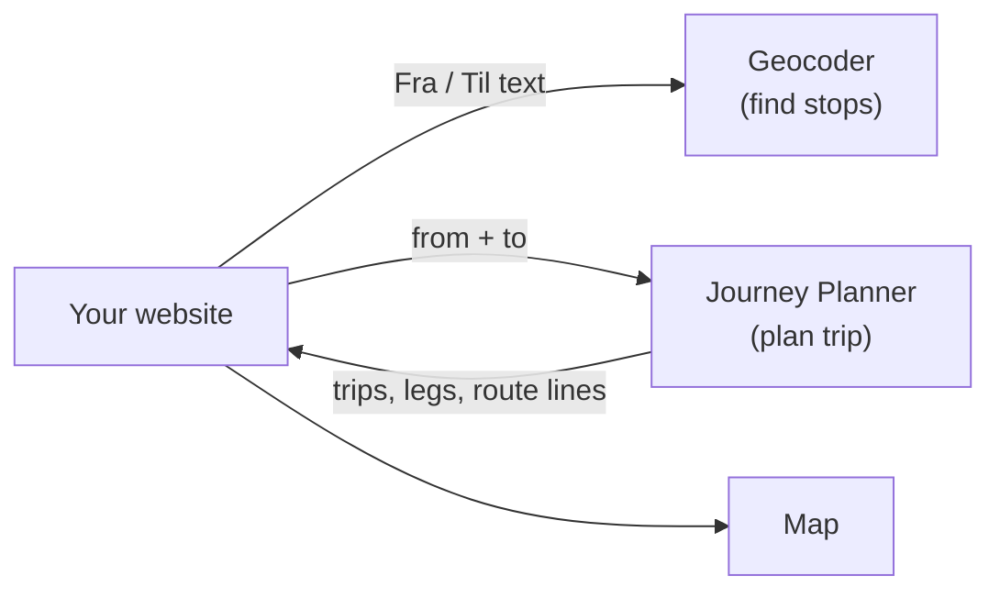

# Entur bus planner · your choice

## The task

Build a small website: type where you start and where you're going, get bus trips back, and see
the chosen trip drawn on a map. You start from an empty folder.

Everything else is your call: the harness (Claude Code, opencode, Codex, ...), the language and
framework, and how you work with the agent. Try a spec workflow you haven't used before, or none,
and compare with the people next to you afterwards.

## Outline

1. **Pick your tools.** Harness, stack, and a method (below).
2. **Try the API by hand first.** Look up two stops with the Geocoder, then plan a trip between
   them in the GraphQL IDE. Ten minutes here saves an hour of the agent guessing.
3. **Search.** Two fields, *From* and *To*, with suggestions as you type.
4. **Results.** The next few bus trips: departure, arrival, duration, line numbers, changes.
5. **Map.** Pick a trip and see its route on a map, bus and walking parts told apart.

You're done when `Jernbanetorget` → `Storo` shows bus trips and clicking one draws it on the map.

## The API

Entur's open APIs cover all public transport in Norway. Free, no API key, no sign-up. Every
request must send one header: `ET-Client-Name: <company>-<application>`, for example
`knowit-workshop-ola`. CORS is open, so a page in the browser can call them directly; a backend is
optional.

| What | Where |
|---|---|
| Find stops and addresses | Geocoder v3: `GET https://api.entur.io/geocoder/v3/autocomplete?q=Storo` |
| Plan a trip | Journey Planner v3 (GraphQL): `POST https://api.entur.io/journey-planner/v3/graphql`, query `trip` |
| Try queries in the browser | [GraphQL IDE](https://api.entur.io/graphql-explorer/journey-planner-v3) |
| Docs | [developer.entur.no](https://developer.entur.no/docs/open-services) |
| Docs for your agent | [developer.entur.no/llms.txt](https://developer.entur.no/llms.txt), and any docs page as Markdown by adding `.md` |

Good to know:

- **Use Geocoder v3.** v1 and v2 were deprecated in June 2026, but most examples online, and most
  AI models, still use them.
- The Geocoder returns GeoJSON. Each result has an `id` (stops look like `NSR:StopPlace:58366`)
  and coordinates as **`[lon, lat]`**, while most map libraries want `[lat, lon]`.
- `trip` takes `from` and `to` as either a stop id (`place`) or `coordinates`.
- Each leg of a trip has its route line in `pointsOnLink.points`, an encoded polyline (Google
  format, precision 5).
- **Buses only:** filter with `modes`. If you set `transportModes`, also set `accessMode` and
  `egressMode` to `foot`. Without them a search from coordinates or an address returns no trips,
  and no error.
- `expectedStartTime` includes real-time data, `aimedStartTime` is the timetable.
- Any map library works. OpenStreetMap tiles are free for this; show their attribution.

## Pick a method

All optional. Each one has its own install steps in its README.

- [Spec Kit](https://github.com/github/spec-kit): specify → plan → tasks → implement, one
  artifact per step.
- [OpenSpec](https://github.com/Fission-AI/OpenSpec): propose a change against living specs,
  apply it, archive it.
- [Superpowers](https://github.com/obra/superpowers): skills that make the agent brainstorm, plan,
  test first and review before it calls something done.

This branch has a minimal `AGENTS.md` (`CLAUDE.md` points to it) with the API facts above. Add
your stack and commands to it as you decide them.

## Finished early?

- Leave at a chosen time, or arrive by a time
- Show delays from real-time data
- "Use my location" as the start
- Other modes: tram, metro, train, ferry
- A departure board for the start stop
- Save favourite trips

## Licences

Entur's data is open under [NLOD](https://data.norge.no/nlod/en/2.0); show "Data made available by
Entur" in your app. OpenStreetMap data is © OpenStreetMap contributors. Spec Kit, OpenSpec and
Superpowers carry their own licences. This workshop is not affiliated with or endorsed by any of
these projects.
